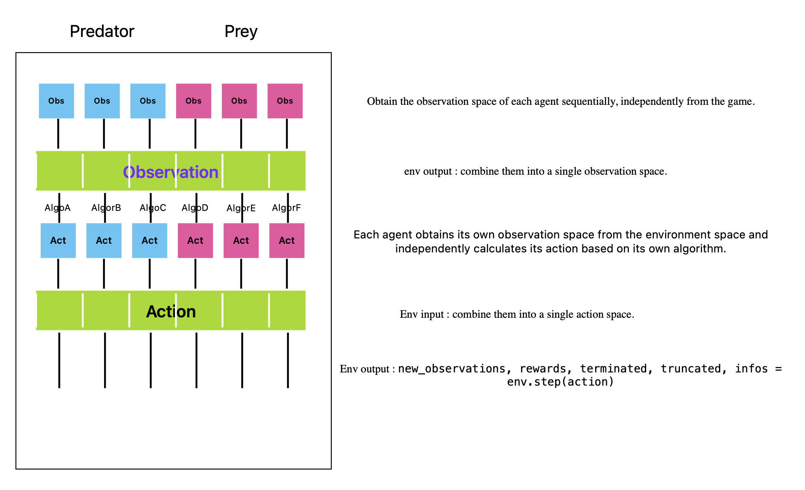

# predatorandpreygameEnv1

## Running the Game

We can run the game using the `main.py` file, which using a mathematically designed movement strategy. This file does not set up an environment.

We can also run the game using the `gym_env.py` file, which sets up an environment and uses a random strategy.

---

## Tasks to be Done

- Refactoring and organizing the code.
- Structuring the architecture and using appropriate variables.
- The obstacle collision detection part currently has issues, and the edge collision detection function needs to be rewritten.
- A new reproduction model has been adopted, so the game parameters need to be adjusted.
- There are still many small bugs that need to be fixed.

---

## Current Multi-Agent Reinforcement Learning Organization

